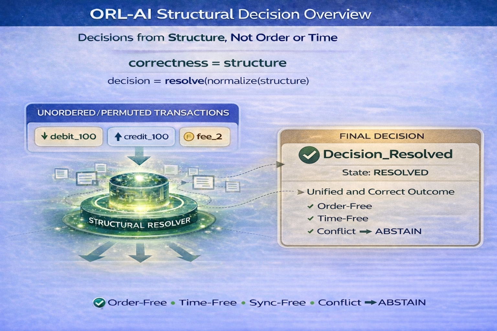

# ⭐ **ORL-AI**

**Orderless Intelligence — Structural Decision System**

**Deterministic decision resolution where correctness emerges from structure**


**correctness = structure**

---

**Structure-Based Decision Resolution • Open Reference Implementation**

- same signals  
- different arrival order  
- no time  
- no synchronization  
- independent nodes  

→ **Same final decision.**

**No Time • No Order • No Coordinator**  
**Structure alone determines correctness — even under incomplete, unordered, and unsynchronized conditions**

---

## ⚡ **The Shift**

AI today processes data.  
ORL-AI resolves decisions.

AI depends on:

- training  
- data order  
- synchronization  

ORL-AI depends on:

- structure alone  

Same signals.  
Same structure.  
Same decision.

---

## ⚡ **The Breakthrough**

Two independent systems receive incomplete, delayed, and unordered signals —  
and still arrive at the exact same final decision.

No ordering guarantees.  
No timing guarantees.  
No synchronization guarantees.  

Yet decision is guaranteed by structure.

---

## 🧭 **Visual Overview**



---

## ⚡ **Try it in 30 seconds**

Run:

```
python demo/orl_ai_demo_base_v4_1.py
```

Observe:

- same signals  
- different arrival permutations  
- no time  
- no synchronization  
- independent nodes  

→ **same final decision**

**Action_Isolate**

(State: **RESOLVED**)

---

## 🔗 **Quick Links**

### 📘 **Docs**

- [Quickstart](docs/Quickstart.md)
- [FAQ](docs/FAQ.md)
- [Test Guide](docs/Test-Guide.md)
- [Proof Sketch](docs/Proof-Sketch.md)
- [Structural Overview](docs/ORL-AI-Structural-Decision-Overview-v1.png)

---

### ⚡ **Demos**

- [Python Reference Demo](demo/orl_ai_demo_base_v4_1.py)

---

### 📤 **Outputs**

- [Sample Output (JSON)](outputs/orl_ai_result_v4_1.json)

---

### 🔍 **Verification**

- [Verify Instructions](VERIFY/VERIFY.txt)
- [Demo Hash Freeze](VERIFY/FREEZE_DEMO_SHA256.txt)

---

### 📂 **Repository**

- [demo/](demo/) — deterministic structural decision demos  
- [docs/](docs/) — concepts, proofs, and usage  
- [outputs/](outputs/) — deterministic decision outputs  
- [VERIFY/](VERIFY/) — reproducibility and hash verification  

---

## ⚡ **30-Second Proof**

**Step 1:**  
Run the demo.

Nodes operate independently → decision incomplete

**Step 2:**  
Structural merge occurs.

**Final Output:**

**Action_Isolate**

**Key Observation:**

- order changed  
- time irrelevant  
- decision unchanged  

This is not prediction.  
This is structural convergence.

---

## ⚡ **Structural Invariant**

**same normalized structure -> same decision**

Independent of:

- arrival order  
- timing differences  
- system isolation  

---

## ⚡ **Core Truth**

Decision does not come from order.  
Decision does not come from time.

**Decision comes from structure.**

---

## ⚡ **Core Identity**

`correctness != training + data_order + synchronization`

`decision = resolve(normalize(structure))`

---

## ⚡ **Governance Model (Critical)**

ORL-AI does not just resolve decisions.  
It governs decision validity.

- valid structure -> **RESOLVED**  
- missing structure -> **INCOMPLETE**  
- conflicting structure -> **ABSTAIN**  

**No forced conclusions.**  
**No unsafe decisions.**

---

## 🧾 **Structural Lineage**

ORL-AI extends the structure-first foundation across domains:

- `SSUM-Time` -> time from structure  
- `STOCRS` -> computation from structure  
- `ORL` -> ledger truth from structure  
- `ORL-Money` -> financial correctness from structure  
- `ORL-Chat` -> meaning from structure  
- `ORL-AI` -> decision correctness from structure  

Each domain removes dependence on time, order, and synchronization —  
while preserving correctness through structure.

---

## 💡 **What ORL-AI Demonstrates**

Decision correctness does not require:

- timestamps  
- input ordering  
- synchronized systems  
- continuous connectivity  

Instead:

`correctness = structure`

---

## ⚡ **Example (unordered signals)**

A decision is treated as structure, not sequence.

**Example:**

- fever  
- cough  
- fatigue  

**Resolution:**

`resolve(normalize(structure)) -> decision`

---

## ⚡ **Minimal Resolver Definition**

`S = set of signals`

`R = structural rules`

`decision = resolve(normalize(S))`

Rules are implicit in structural evaluation, not external sequencing.

**Resolution outcomes:**

- valid -> **RESOLVED**
- missing -> **INCOMPLETE**
- conflicting or multiple incompatible decisions -> **ABSTAIN**

---

## ⚖️ **What ORL-AI Is / Is Not**

### **ORL-AI IS:**

- a structural decision resolution model  
- a deterministic decision layer  
- a convergence-based intelligence model  
- a domain application of ORL  

### **ORL-AI IS NOT:**

- a full AI system  
- a machine learning model  
- a prediction engine  
- a training framework  
- a chatbot or conversational interface  
- a generative AI system  

---

## 🔥 **Core Structural Law**

- valid -> **RESOLVED**
- missing -> **INCOMPLETE**
- conflicting -> **ABSTAIN**

---

## 🛡 **Classical Compatibility Guarantee**

For valid decision structures:

`classical systems = ORL-AI result`

For incomplete or conflicting structure:

- **INCOMPLETE** -> no forced decision  
- **ABSTAIN** -> no unsafe decision  

---

## 🧮 **Structural Guarantees**

- Determinism -> same normalized structure -> same decision  
- Order Independence -> invariant under permutation  
- Time Independence -> no temporal dependency  
- Replay Safety -> reproducible outcomes  

---

## 🔁 **Replay Guarantee**

`same normalized structure -> same decision`

Even if:

- arrival order changes  
- signals are delayed  
- systems are offline  

---

## 🧭 **The Scenario**

Three systems:

- Node-A  
- Node-B  
- Node-C  

Each sees partial signals.

After structural merge:

**Action_Isolate**

---

## 🛡 **Safety Model**

- **INCOMPLETE** -> no conclusion  
- **ABSTAIN** -> no unsafe conclusion  

---

## 🌍 **Why This Matters**

Traditional systems:

- depend on order  
- depend on timing  
- rely on probabilistic inference  

ORL-AI:

- resolves decisions deterministically  
- eliminates ambiguity  
- enables safe decision systems  

---

## ⚡ **What This Challenges**

Traditional assumption:

`decision = data + time + sequence + training`

ORL-AI shows:

`decision = structure`

---

## 🧱 **Minimal Integration**

`input signals -> resolve(normalize(structure)) -> decision`

---

## 🚀 **Run Locally**

Run:

```
python demo/orl_ai_demo_base_v4_1.py
```

Or generate output:

```
python demo/orl_ai_demo_base_v4_1.py --write-output --output outputs/orl_ai_result_v4_1.json
```

This will:

- execute deterministic structural resolution  
- generate verifiable output  
- reproduce the same final decision  

**Expected result:**

**Action_Isolate**

---

## 📊 **Comparison**

### **Traditional AI:**

- order dependent  
- time dependent  
- probabilistic  

### **ORL-AI:**

- no order  
- no time  
- deterministic decision  

---

## 🌍 **Real-World Implications**

- AI validation layers  
- cybersecurity systems  
- financial decision systems  
- distributed intelligence  
- sensor fusion systems  
- multi-agent systems  

---

## 🧭 **Adoption Path**

### **Immediate:**

- validation layer  
- safety layer  

### **Advanced:**

- distributed decision systems  
- autonomous systems  

---

## 📜 **License**

See: [LICENSE](LICENSE)

Reference Implementation: 
**Open Standard** — free to use, study, implement, extend, and deploy

Architecture:  
Creative Commons BY-NC 4.0

---

## 🔗 **Related Projects**

- [ORL](https://github.com/OMPSHUNYAYA/Orderless-Ledger)
- [STOCRS](https://github.com/OMPSHUNYAYA/STOCRS)
- [SSUM-Time](https://github.com/OMPSHUNYAYA/SSUM-Time)

---

## ⚡ **Final Truth**

Signals arrived in different orders.  
Systems saw different fragments.  
Time was inconsistent.

Yet decision was the same.

**Correctness is structure.**
