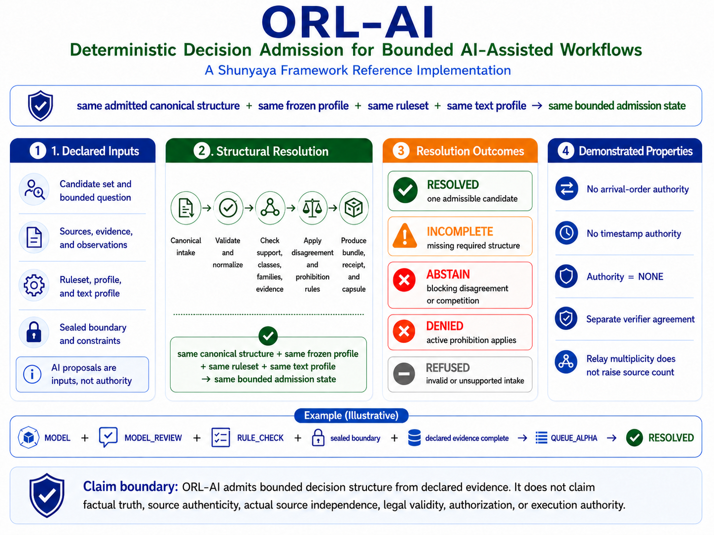

# ⭐ ORL-AI v5.0.0

## **Deterministic Decision Admission for Bounded AI-Assisted Workflows**


[](https://github.com/OMPSHUNYAYA/ORL-AI/actions/workflows/verify.yml)

ORL-AI is a deterministic structural layer for deciding whether a declared candidate from an AI-assisted workflow may be admitted under a frozen profile.

It does not train a model, generate a prediction, rank unrestricted alternatives, infer factual truth, or grant execution authority. Model outputs enter the resolver as bounded proposals. Admission is governed by canonical declared structure, explicit evidence references, declared source classes and source families, a sealed observation boundary, deterministic prohibition rules, and conservative non-result states.

Its governing contract is:

`same admitted canonical structure + same frozen profile + same ruleset + same text profile -> same bounded admission state`

Proposal arrival order and wall-clock timestamps are not resolution authority within the declared model.

`operational arrival order != bounded decision authority`

---

## 🧭 Visual Overview



---

## 🔗 Quick Links

### 📘 Documentation

- [Quickstart](docs/Quickstart.md)
- [Architecture](docs/Architecture.md)
- [Decision Profile](docs/Decision_Profile.md)
- [State Precedence](docs/State_Precedence.md)
- [Dependency Elimination](docs/Dependency_Elimination.md)
- [Claim and Threat Boundary](docs/Claim_and_Threat_Boundary.md)
- [Decision-Admission Capsule](docs/Decision_Admission_Capsule.md)
- [Integration Guide](docs/Integration_Guide.md)
- [Text Profile](docs/Text_Profile.md)
- [Verification Guide](docs/Verification_Guide.md)
- [FAQ](docs/FAQ.md)
- [Structural Overview](docs/ORL-AI-Structural-Overview.png)

### ⚙️ Reference Implementations and Browser Laboratory

- [Python Reference Kernel](demo/ORL_AI_Reference_Kernel_v5_0_0.py)
- [JavaScript Strict JSON Parser](demo/ORL_AI_Strict_Json_v5_0_0.js)
- [JavaScript Browser Resolver](demo/ORL_AI_Browser_Resolver_v5_0_0.js)
- [Structural Laboratory](demo/ORL_AI_Structural_Lab_v5_0_0.html)
- [Python Decision-Admission Capsule Implementation](demo/ORL_AI_Decision_Admission_Capsule_v5_0_0.py)

### 🔍 Verification and Evidence

- [Complete Cross-Platform Functional Verification Runner](VERIFY_ALL.py)
- [GitHub Actions Verification Workflow](.github/workflows/verify.yml)
- [Independent Python Verifier](verifier/ORL_AI_Independent_Verifier_v5_0_0.py)
- [Python-JavaScript Cross-Check](verifier/ORL_AI_Cross_Language_Cross_Check_v5_0_0.py)
- [Raw-Intake Parity Verifier](verifier/ORL_AI_Raw_Intake_Parity_Verifier_v5_0_0.py)
- [Cross-Language Edge Verifier](verifier/ORL_AI_Cross_Language_Edge_Verifier_v5_0_0.py)
- [SHA-256 Fallback Verifier](verifier/ORL_AI_SHA256_Fallback_Verifier_v5_0_0.js)
- [Determinism Verifier](verifier/ORL_AI_Determinism_Verifier_v5_0_0.py)
- [State-Precedence Verifier](verifier/ORL_AI_State_Precedence_Test_v5_0_0.py)
- [Cross-Language Vector Generator](verifier/ORL_AI_Cross_Language_Vector_Generator_v5_0_0.py)
- [Seeded Property Verifier](verifier/ORL_AI_Seeded_Property_Verifier_v5_0_0.py)
- [Assurance Verifier](verifier/ORL_AI_Assurance_Verifier_v5_0_0.py)
- [Frozen Corpus Manifest](corpus/ORL_AI_Frozen_Corpus_Manifest_v5_0_0.json)
- [Cross-Language Parity Vectors](parity/ORL_AI_Cross_Language_Parity_Vectors_v5_0_0.json)
- [Decision-Admission Capsule Vectors](capsules/ORL_AI_Decision_Admission_Capsule_Vectors_v5_0_0.json)
- [Hostile Corpus Manifest](hostile/ORL_AI_Hostile_Corpus_Manifest_v5_0_0.json)
- [Falsification Corpus Manifest](falsification/ORL_AI_Falsification_Corpus_Manifest_v5_0_0.json)
- [Raw-Intake Parity Receipt](VERIFY/ORL_AI_Raw_Intake_Parity_Receipt_v5_0_0.json)
- [Cross-Language Edge Receipt](VERIFY/ORL_AI_Cross_Language_Edge_Receipt_v5_0_0.json)
- [Determinism Receipt](VERIFY/ORL_AI_Determinism_Receipt_v5_0_0.json)
- [SHA-256 Fallback Verification Report](VERIFY/ORL_AI_SHA256_Fallback_Verification_Report_v5_0_0.txt)
- [Determinism Verification Report](VERIFY/ORL_AI_Determinism_Verification_Report_v5_0_0.txt)
- [State-Precedence Receipt](VERIFY/ORL_AI_State_Precedence_Receipt_v5_0_0.json)
- [Complete Verification Summary](VERIFY/ORL_AI_Complete_Verification_Summary_v5_0_0.txt)
- [Verification Entry Point](VERIFY/VERIFY.txt)

---

## What the Package Provides

- A deterministic Python reference kernel.
- A separately implemented Python verifier that does not import the producer kernel.
- A separately implemented JavaScript resolver.
- A browser laboratory for local structural resolution, including direct `file:` use through a dependency-free SHA-256 fallback when Web Crypto is unavailable.
- Frozen inputs, bundles, receipts, parity vectors, and capsule artifacts.
- Strict raw-JSON intake across Python and JavaScript with invalid-UTF-8, byte-order-mark, duplicate-key, floating-number, non-finite-number, out-of-range-integer, unpaired-surrogate, and trailing-content refusal.
- A runtime-independent exact Unicode scalar-sequence text profile.
- Explicit `RESOLVED`, `INCOMPLETE`, `ABSTAIN`, `DENIED`, and `REFUSED` states.
- A frozen decision-admission profile with exact source, family, class, evidence, boundary, disagreement, and prohibition requirements.
- Public receipts and private reconstruction bundles with a bound artifact-construction profile rather than a static verification-status assertion.
- Privacy-reduced Decision-Admission Capsules.
- Deterministic capsule verification and comparison.
- A live Python-JavaScript cross-implementation checker for frozen examples.
- Raw-intake parity across the Python producer, independent Python verifier, JavaScript parser, and JavaScript resolver CLI.
- Cross-language edge parity for identifier ordering, Unicode object-key ordering, prototype-like key retention, text controls, exact integers, and resource limits.
- A frozen nine-tier state-precedence verifier.
- A reproducible seeded property verifier.
- Hostile-input, falsification, relay, order, identity, boundary, privacy, resource, and tamper assurance.
- Bounded source-level minimal-witness construction across the reference kernel, independent verifier, and JavaScript resolver.
- Automated GitHub Actions verification on pushes and pull requests, including the functional runtime matrix, deterministic artifact reproduction, and selected-file hash enforcement when a final manifest is present.

---

## Quick Start

### Requirements

- Python 3.9 or later.
- Node.js 18 or later for JavaScript verification.
- A modern browser for the Structural Laboratory.

### Complete functional verification

From the repository root, use any one of these commands:

```text
python -B VERIFY_ALL.py
VERIFY_ALL.bat
sh verify_all.sh
```

`VERIFY_ALL.py` is the shared cross-platform runner. The Windows and shell files are thin wrappers. Every path stops at the first failing functional stage and prints:

```text
ORL-AI v5.0.0 functional verification: PASS
```

when every included verification stage succeeds.


### Open the browser laboratory

For the most consistent browser behavior, start a local HTTP server from the repository root:

```text
python -m http.server 8000
```

Then open:

```text
http://localhost:8000/demo/ORL_AI_Structural_Lab_v5_0_0.html
```

Stop the server with `Ctrl+C`.

The HTML file can also be opened directly. When Web Crypto is unavailable, the resolver uses its verified pure-JavaScript SHA-256 implementation. A local HTTP server remains useful when a browser applies additional local-file restrictions.

---

## Current Verification Evidence

The included reports and GitHub Actions workflow record the following passing results:

```text
Python reference-kernel self-test:                 26/26 PASS
Independent frozen-corpus reconstruction:          10/10 PASS
JavaScript strict-JSON self-test:                   19/19 PASS
Raw-intake cross-language parity:                   11/11 PASS
JavaScript resolver and frozen byte parity:         10/10 PASS
Origin-independent SHA-256 fallback verification:   18/18 PASS
Live Python-JavaScript example cross-check:         10/10 PASS
Cross-language edge parity:                          8/8 PASS
Regeneration parity and idempotence:                 10/10 PASS
Seeded structural property assertions:             64/64 PASS
Decision-Admission Capsule self-test:                6/6 PASS
State-precedence scenarios:                         15/15 PASS
Hostile-input corpus:                              20/20 PASS
Falsification corpus:                              11/11 PASS
Bounded 256-observation witness construction:            PASS
Direct bundle-tamper rejection:                         PASS
Public-receipt disclosure boundary:                     PASS
Structural identity separation:                         PASS
Artifact-profile identity binding:                       PASS
Artifact-profile tamper detection:                       PASS
Resource and text-profile controls:                     PASS
```

The [ORL-AI Deterministic Verification workflow](.github/workflows/verify.yml) runs the complete functional verifier across the declared CI runtime pairs, checks committed artifact reproduction and second-run idempotence, and verifies `hashes/SHA256SUMS.txt` whenever that final-freeze manifest is present.

These results apply only to the declared v5.0.0 schemas, profile, ruleset, text profile, resource limits, implementations, corpora, examples, and verification procedures. Producer tests, reconstruction checks, and cross-language parity do not constitute independent third-party certification, formal verification, security qualification, or domain validation.

---

## Processing Model

`raw JSON -> strict intake -> schema and resource validation -> exact text-profile validation -> canonical structural normalization -> source and evidence admission -> boundary evaluation -> prohibition and disagreement evaluation -> profile evaluation -> bounded state -> private bundle + public receipt -> Decision-Admission Capsule`

The resolver derives the admission state from admitted canonical structure rather than simulating a model-response timeline.

---

## Core Position

ORL-AI separates responsibilities that are frequently blended together:

1. A model or another declared source proposes a candidate.
2. Evidence references bind support observations to declared material.
3. A frozen profile defines source, family, class, evidence, and participation requirements.
4. A deterministic resolver admits, withholds, abstains, denies, or refuses.
5. A private bundle, public receipt, and capsule preserve inspectable structural evidence.
6. Authorization and execution remain outside ORL-AI.

`AI proposal != admitted decision`

`admitted decision != execution authority`

Every generated bundle, receipt, and capsule declares:

`authority = NONE`

---

## Current Decision-Admission Profile

The current package supports one frozen profile. Unknown profile identifiers are refused. Additional profiles require their own immutable identifiers, corpora, parity vectors, and cross-implementation verification before inclusion.

The current profile requires:

- at least three distinct supporting source identifiers;
- at least three declared source families;
- support from the `MODEL`, `MODEL_REVIEW`, and `RULE_CHECK` source classes;
- at least one declared evidence reference for every support observation;
- a sealed exact observation and evidence boundary;
- no blocking opposition;
- no support for a competing candidate;
- no active prohibition affecting a supported candidate.

Declared source-family diversity is not proof of actual model independence. For example, one operator could label three controlled endpoints as three source families and satisfy the structural family count without establishing genuine independence. Source identity, source family, evidence authenticity, factual correctness, and domain suitability remain outside the resolver unless established by surrounding systems.

---

## Resolution and Refusal States

### `RESOLVED`

Exactly one candidate satisfies the frozen admission profile, the declared boundary is sealed and complete, no blocking disagreement is present, and no active prohibition applies.

`RESOLVED` means that one candidate is structurally admitted within the declared profile. It does not mean the candidate is true, safe, wise, lawful, current, or authorized for execution.

### `INCOMPLETE`

The admitted structure is valid but lacks a sealed boundary, an expected observation, an expected evidence item, enough distinct support sources, enough declared source families, one or more required source classes, or evidence on a support observation.

The result includes deterministic repair requirements where applicable.

### `ABSTAIN`

The admitted structure is valid but contains bounded disagreement or competition that prevents a single candidate from being admitted.

Examples include:

- opposition to a supported candidate;
- competing partial support;
- multiple eligible candidates;
- one source supporting multiple candidates;
- one source both supporting and opposing the same candidate.

### `DENIED`

An active `FORBID_CANDIDATE` constraint applies to a supported candidate. Prohibition is evaluated before candidate admission.

### `REFUSED`

The submitted structure violates the supported intake contract.

Examples include:

- unknown fields;
- duplicate identifiers;
- unsupported profiles;
- caller-derived authority;
- malformed references;
- undeclared observations;
- floating JSON numbers;
- duplicate JSON keys;
- values outside the exact interoperable integer range;
- resource-bound violations.

Strict-parser refusal occurs before an ORL-AI document is admitted. A structurally parsed document that violates the supported contract produces a canonical `REFUSED` result.

---

## Structural Objects

An ORL-AI input contains:

- `context`: bounded question, candidate set, ruleset, profile, text profile, evidence mode, authority mode, and boundary state;
- `sources`: declared source identifiers, source families, and source classes;
- `evidence`: evidence identifiers, kinds, and SHA-256 digests;
- `observations`: source-bound support, opposition, or abstention statements about declared candidates;
- `constraints`: active or inactive candidate prohibitions;
- `boundary`: exact expected observation and evidence identifier sets.

The resolver does not accept natural-language prompts as decision authority. An application may use a separate extraction layer, but the resulting structure must pass ORL-AI intake and admission rules.

---

## Structural Identity Separation

ORL-AI distinguishes:

- `submitted_input_commitment`: commitment to the exact parsed submission;
- `normalized_input_commitment`: commitment to the admitted canonical structure;
- `decision_resolution_id`: identity of the bounded structural result;
- `private_bundle_id`: identity of the private reconstruction bundle, including submission trace and the bound artifact profile;
- `public_receipt_id`: identity of the reduced public receipt.

Two submissions with different array order can therefore have different submission commitments and private bundle identities while sharing the same normalized commitment and decision resolution identity.

`different submission order + same canonical structure -> same decision_resolution_id`

This preserves order-independent resolution without erasing provenance differences.

---

## Bounded Minimal Admission Witness

For a resolved candidate, ORL-AI computes the smallest deterministic witness satisfying the current source-count, source-family, source-class, and evidence conditions.

Witness construction operates at the distinct-source level:

1. group valid support observations by source;
2. select one deterministic representative observation per source;
3. resolve the smallest source combination satisfying the frozen profile;
4. apply lexicographic tie-breaking.

Repeated relay observations from one source do not expand source authority or force observation-level combination enumeration.

The package includes a stress case with:

- `256` admitted observations;
- `5` distinct supporting sources;
- `252` observations from one source;
- a deterministic `5`-observation witness;
- agreement across the Python reference kernel, independent Python verifier, and JavaScript resolver.

The witness is bounded reconstruction evidence. It is not a formal theorem, signature, legal attestation, source-authentication result, or truth proof.

---

## Public Receipt and Private Bundle

The private bundle retains admitted structural material needed for reconstruction.

The public receipt records:

- state and reason;
- admitted candidate where applicable;
- counts;
- profile and ruleset identities;
- structural commitments;
- decision, bundle, and receipt identity links.

It omits direct source identifiers, observation identifiers, and evidence identifiers.

Commitments are deterministic hashes. They are not encryption, secrecy guarantees, zero-knowledge proofs, digital signatures, or protection against guessing low-entropy structures.

Both artifacts declare:

`authority = NONE`

---

## Decision-Admission Capsule

A Decision-Admission Capsule is a compact privacy-reduced artifact derived from a verified private bundle.

`verified private bundle -> structural result + commitments + identity links -> capsule`

A capsule carries:

- state and reason;
- candidate identifier where applicable;
- frozen ruleset, profile, and text-profile identifiers;
- boundary state and counts;
- structural commitments;
- decision, private-bundle, and public-receipt identities;
- capsule identity.

Supported comparison relations include:

- `IDENTICAL`
- `EQUIVALENT_RESOLUTION`
- `COMPATIBLE_OUTCOME`
- `DIVERGES_STATE`
- `DIVERGES_CANDIDATE`
- `DIVERGES_STRUCTURE`
- `INCOMPARABLE_CONTEXT`
- `UNSUPPORTED`

These are bounded structural relations. They are not universal semantic, temporal, legal, safety, or consensus relations.

---

## Main Commands

### Run the reference self-test

```text
python -B demo/ORL_AI_Reference_Kernel_v5_0_0.py --self-test
```

### Resolve the representative input

```text
python -B demo/ORL_AI_Reference_Kernel_v5_0_0.py --resolve examples/ORL_AI_resolved-consensus_Input_v5_0_0.json --output VERIFY/Representative_Bundle.json --receipt-output VERIFY/Representative_Public_Receipt.json
```

### Verify a generated bundle

```text
python -B demo/ORL_AI_Reference_Kernel_v5_0_0.py --verify-bundle VERIFY/Representative_Bundle.json
```

### Independently verify the frozen corpus

```text
python -B verifier/ORL_AI_Independent_Verifier_v5_0_0.py --verify-corpus corpus/ORL_AI_Frozen_Corpus_Manifest_v5_0_0.json --strict-canonical
```

### Cross-check Python and JavaScript on every shipped example

```text
python -B verifier/ORL_AI_Cross_Language_Cross_Check_v5_0_0.py --all-examples
```

### Verify strict JavaScript raw intake

```text
node demo/ORL_AI_Strict_Json_v5_0_0.js --self-test
```

### Verify origin-independent SHA-256 fallback

```text
node verifier/ORL_AI_SHA256_Fallback_Verifier_v5_0_0.js
```

### Verify raw-intake parity

```text
python -B verifier/ORL_AI_Raw_Intake_Parity_Verifier_v5_0_0.py
```

### Verify cross-language edge cases

```text
python -B verifier/ORL_AI_Cross_Language_Edge_Verifier_v5_0_0.py
```

### Verify frozen state precedence

```text
python -B verifier/ORL_AI_State_Precedence_Test_v5_0_0.py
```

### Verify existing parity vectors

```text
python -B verifier/ORL_AI_Cross_Language_Vector_Generator_v5_0_0.py --verify-existing
```

### Verify committed artifact reproduction and idempotence

```text
python -B verifier/ORL_AI_Determinism_Verifier_v5_0_0.py
```

### Run reproducible generated-property verification

```text
python -B verifier/ORL_AI_Seeded_Property_Verifier_v5_0_0.py --seed 20260801 --cases 64
```

### Run assurance verification

```text
python -B verifier/ORL_AI_Assurance_Verifier_v5_0_0.py --self-test --write-report
```

### Run Decision-Admission Capsule tests

```text
python -B demo/ORL_AI_Decision_Admission_Capsule_v5_0_0.py --self-test
```

---

## Package Structure

```text
ORL-AI_v5_0_0/
  README.md
  LICENSE
  VERIFY_ALL.py     shared cross-platform functional verification runner
  VERIFY_ALL.bat    Windows wrapper
  verify_all.sh     Linux and macOS wrapper
  .github/         automated functional verification workflow
  demo/            reference kernel, strict JavaScript parser, resolver, capsule implementation, and browser laboratory
  verifier/        independent reconstruction, raw and structural parity, fallback, determinism, precedence, property, and assurance tooling
  corpus/          frozen bounded decision-admission scenarios
  parity/          Python and JavaScript parity vectors
  capsules/        capsule vectors, artifacts, comparisons, inputs, and source bundles
  hostile/         strict hostile-input corpus
  falsification/   deliberately altered bundles and capsules
  examples/        representative inputs, private bundles, and public receipts
  VERIFY/          verification reports, receipts, and entry-point guidance
  docs/            architecture, profile, FAQ, boundaries, integration, and verification guidance
```

---

## Canonical Data Contract

The supported data contract includes:

- strict UTF-8 JSON;
- duplicate-key refusal;
- floating-number, `NaN`, and infinity refusal;
- invalid UTF-8, UTF-8 byte-order-mark, trailing-content, and unpaired-surrogate refusal;
- exact interoperable integer range `-9007199254740991` through `9007199254740991`;
- exact Unicode scalar-sequence preservation without runtime normalization;
- fixed supported field sets;
- bounded identifiers, strings, arrays, objects, observations, evidence, sources, and constraints;
- deterministic canonical JSON identities;
- compact, scalar-ordered-key, LF-terminated canonical artifact files.

Each private bundle includes an `artifact_profile` descriptor with a frozen profile identifier, canonicalization description, and identity algorithm. The descriptor is included in the private-bundle identity. Verification is established by deterministic reconstruction, not by a literal `PASS` field inside the artifact.

---

## Text Profile

ORL-AI v5.0.0 uses a frozen exact Unicode scalar-sequence profile.

Strings are preserved as exact scalar sequences. The implementation does not use the host runtime's Unicode database to normalize admitted text.

- Canonically equivalent sequences remain distinct unless their code points are identical.
- Identifiers refuse the frozen prohibited control, format, and surrogate code-point table.
- Permitted presentation strings follow the explicit text-profile rules.
- The same rules are implemented in the Python producer, independent Python verifier, and JavaScript resolver.

`"café" != "cafe\u0301"`

See [Text Profile](docs/Text_Profile.md).

---

## Dependency-Elimination Boundary

ORL-AI removes the following from sole bounded resolution authority:

- proposal arrival order;
- wall-clock timestamps;
- model response sequence;
- duplicate relay multiplicity;
- one model's unrestricted output;
- caller-declared authority.

It does not eliminate the operational need for:

- models and other proposal sources;
- evidence collection;
- source and evidence authentication;
- transport and storage;
- replay protection;
- domain review;
- security controls;
- legal and organizational governance;
- authorization;
- execution systems.

---

## What ORL-AI Is Not

ORL-AI is not:

- a large language model;
- a machine-learning training method;
- a prediction or unrestricted ranking engine;
- a truth detector;
- a model-independence detector;
- a source-authentication system;
- an evidence-authenticity system;
- a consensus protocol;
- an identity or permission system;
- an action executor;
- a safety guarantee;
- a substitute for domain validation.

---

## Claim Boundary

ORL-AI does not establish:

- unrestricted natural-language understanding;
- factual truth;
- source authenticity;
- actual source independence;
- evidence authenticity;
- legal validity;
- authorization;
- execution authority;
- safety or suitability of a candidate;
- completeness beyond the sealed declared boundary;
- production suitability without independent domain validation;
- semantic equivalence between different Unicode scalar sequences.

A resolved candidate, verified bundle, public receipt, or verified capsule does not by itself establish that the candidate is true, authorized, safe, lawful, current outside the declared structure, or suitable for execution.

---

## 📜 License

See: [LICENSE](LICENSE)

The ORL-AI reference implementation and associated verification artifacts are free to use, copy, modify, test, study, and redistribute without a license fee, subject to the license terms stated in the repository.

Documentation, architecture materials, specifications, diagrams, and explanatory content are subject to the separate terms stated in the LICENSE.

This repository does not claim recognition as a formal technical standard, security certification, production qualification, or third-party verification.

---

## 🧭 Final Statement

**ORL-AI transforms bounded canonical AI-assisted proposal evidence into deterministic, inspectable decision-admission artifacts without treating model response order, timestamps, or unrestricted model output as decision authority.**
