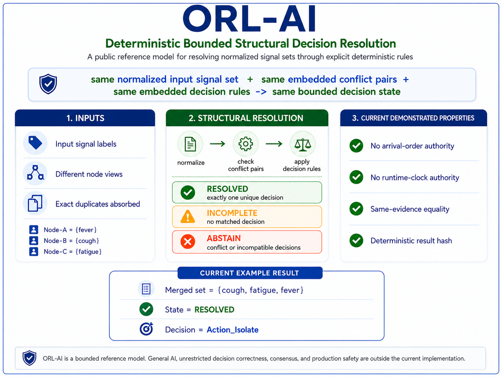

# ⭐ ORL-AI

## Deterministic Bounded Structural Decision Resolution

**A public reference model for resolving supported signal sets through explicit deterministic rules**


---

ORL-AI is a deterministic rule-based reference model for resolving a bounded decision state from a normalized set of supported signals.

The current implementation does not train, predict, infer unrestricted meaning, or generate new decisions.

It normalizes input signal strings, checks an embedded conflict-pair table, and applies an embedded rule table to produce one of three states:

- `RESOLVED`
- `INCOMPLETE`
- `ABSTAIN`

The current governing relation is:

`same normalized supported signal set + same embedded resolver rules -> same bounded decision state and current result hash`

ORL-AI is developed within the Shunyaya Framework.

---

## 🧭 Visual Overview



---

## ⚡ Try It

Run the Python reference demo:

```bash
python demo/orl_ai_demo_base_v4_1.py
```

Generate the reference JSON output:

```bash
python demo/orl_ai_demo_base_v4_1.py --write-output --output outputs/orl_ai_result_v4_1.json
```

The main reference scenario resolves:

```text
State    = RESOLVED
Decision = Action_Isolate
```

The committed output also records conflict, ambiguity, replay, overlap, and additional bounded rule scenarios.

---

## 🔗 Quick Links

### Documentation

- [Quickstart](docs/Quickstart.md)
- [FAQ](docs/FAQ.md)
- [Test Guide](docs/Test-Guide.md)
- [Model and Invariant Sketch](docs/Proof-Sketch.md)
- [Structural Overview](docs/ORL-AI-Structural-Decision-Overview-v1.png)

### Implementation

- [Python Reference Demo](demo/orl_ai_demo_base_v4_1.py)

### Generated Output

- [Reference Output](outputs/orl_ai_result_v4_1.json)

### Verification

- [Verification Instructions](VERIFY/VERIFY.txt)
- [Frozen Demo Hashes](VERIFY/FREEZE_DEMO_SHA256.txt)

---

## 🧩 Core Model

Let:

- `S` be a collection of supported signal labels
- `N(S)` be normalization by exact duplicate removal and deterministic sorting
- `C` be the embedded conflict-pair table
- `R` be the embedded rule table
- `F(N(S), C, R)` be the bounded resolver result

The current implementation computes:

`decision_state = F(N(S), C, R)`

Normalization is:

`N(S) = sorted(set(S))`

The resolver then evaluates:

1. whether an explicit conflict pair is present;
2. which rule inputs are subsets of the normalized signal set;
3. how many unique decision labels are matched.

---

## ⚖️ Resolution States

### RESOLVED

The resolver returns `RESOLVED` when:

- no explicit conflict pair is present; and
- one unique decision label is matched.

Multiple rules may match and still resolve when all matching rules produce the same decision label.

Example:

```text
alert
verified_source
stable_metrics
low_risk
```

Two `Action_Approve` rules match, but there is only one unique decision:

```text
State    = RESOLVED
Decision = Action_Approve
```

### INCOMPLETE

The resolver returns `INCOMPLETE` when:

- no explicit conflict pair is present; and
- no rule produces a decision.

The resolver does not invent missing signals or force a decision.

### ABSTAIN

The resolver returns `ABSTAIN` when either:

- an explicit conflict pair is present; or
- more than one incompatible decision label is matched.

Examples include:

```text
fatigue + no_fatigue -> ABSTAIN
```

and:

```text
Action_Isolate + Action_Monitor matches -> ABSTAIN
```

`ABSTAIN` is a bounded resolver classification. It is not a guarantee of general safety.

---

## 🧠 Reference Scenario

Three nodes begin with partial signal sets:

```text
Node-A = fever
Node-B = cough
Node-C = fatigue
```

Each local node is initially incomplete.

The local set-union step produces:

```text
cough
fatigue
fever
```

The embedded rule table contains:

```text
{fever, cough, fatigue} -> Action_Isolate
```

The result is:

```text
State             = RESOLVED
Decision          = Action_Isolate
Governance status = ACCEPTED_UNIQUE_MATCH
```

The replay scenario groups the same signals differently:

```text
Replay-X = cough, fatigue
Replay-Y = fever
Replay-Z = empty
```

After local set union, both scenarios contain the same normalized signal set and produce the same current result and hash.

This demonstrates equality after equal normalized evidence is installed.

It does not implement an autonomous networking, delivery, synchronization, or consensus protocol.

---

## 🔀 Permutation Check

The Python demo checks all permutations of the three committed reference node groups:

```text
3! = 6 permutations
```

Expected output:

```text
Permutations checked     = 6
Permutation independence = True
State                    = RESOLVED
Decision                 = Action_Isolate
```

This is exhaustive for the three committed reference groups.

It is not a universal proof for:

- arbitrary signal counts;
- arbitrary node counts;
- arbitrary rule tables;
- arbitrary conflict tables;
- malformed inputs;
- hostile inputs;
- independent implementations.

---

## 🧪 Included Scenarios

The current demo includes the following bounded cases.

### Three-Node Reference

```text
{fever} + {cough} + {fatigue}
-> RESOLVED
-> Action_Isolate
```

### Regrouped Replay

```text
{cough, fatigue} + {fever} + {}
-> RESOLVED
-> Action_Isolate
```

### Explicit Conflict

```text
{fever, cough, fatigue, no_fatigue}
-> ABSTAIN
-> REJECTED_CONFLICT
```

### Multi-Decision Ambiguity

```text
{fever, cough, fatigue, travel_history}
-> Action_Isolate and Action_Monitor match
-> ABSTAIN
-> REJECTED_AMBIGUITY
```

### Nominal Five-Node Case

The scenario uses five declared node containers, with three contributing non-empty signal sets and two empty sets:

```text
{alert} + {verified_source} + {stable_metrics} + {} + {}
-> RESOLVED
-> Action_Approve
```

### Additional Bounded Rule Paths

```text
{verified_source, stable_metrics, low_risk}
-> RESOLVED
-> Action_Approve
```

```text
{alert, critical_signal, verified_source}
-> RESOLVED
-> Action_Escalate
```

### Same-Decision Rule Overlap

```text
{alert, verified_source, stable_metrics, low_risk}
-> multiple matching rules
-> one unique decision
-> RESOLVED
-> Action_Approve
```

---

## 🧾 Governance Report

For each evaluated structure, the implementation reports:

- normalized structure;
- sufficient-structure flag;
- conflict flag;
- ambiguity flag;
- governance status;
- textual resolution basis.

Current governance statuses are:

```text
ACCEPTED_UNIQUE_MATCH
PENDING_INCOMPLETE
REJECTED_CONFLICT
REJECTED_AMBIGUITY
```

These labels describe the current resolver branch taken for the supplied signal set.

They do not establish legal validity, factual correctness, policy authorization, or production approval.

---

## 🔐 Current Result Hash

The demo creates a SHA-256 value from a delimiter-based text payload containing:

- normalized signal structure;
- state;
- selected decision;
- matched decisions.

The current relation is:

`same current payload bytes -> same SHA-256 hash`

For the committed three-node reference and replay scenarios, the output records the same hash because both produce the same normalized signal set and resolver result.

The current field is called `certificate` in the implementation.

In this release, it should be interpreted as a deterministic result hash or receipt for the current payload construction.

It is not yet:

- an independently reconstructed proof;
- a signed certificate;
- an authenticated attestation;
- a ruleset-bound conformance receipt;
- a tamper-proof event history.

---

## 📦 Resolution Capsule

The generated output includes a result capsule containing fields such as:

```text
case_id
normalized_structure
state
decision
matched_decisions
governance_status
resolution_basis
decision_acceptance_rule
certificate
```

The implementation currently labels its proof class as:

```text
STRUCTURAL_DECISION_PROOF
```

For this release, the capsule should be understood as a structured resolver-result record.

Independent proof reconstruction, schema conformance, signature verification, and ruleset binding are future technical targets.

---

## ✅ Demonstrated Properties

Within the current implementation and committed cases, ORL-AI demonstrates:

- deterministic normalization of supported signal strings;
- exact duplicate absorption through set conversion;
- explicit conflict detection;
- deterministic embedded rule matching;
- `RESOLVED`, `INCOMPLETE`, and `ABSTAIN` branches;
- rejection of incompatible matched decisions;
- resolution of multiple matching rules when they share one unique decision;
- equal results for equal normalized signal sets;
- six committed reference-group permutations;
- deterministic current result hashing;
- JSON output generation;
- local execution without a runtime clock, GPS, NTP, database, or live server.

These are bounded implementation and scenario results.

---

## 🚫 What ORL-AI Does Not Establish

ORL-AI v1.0 does not implement or prove:

- general artificial intelligence;
- machine learning;
- model training;
- prediction;
- probabilistic inference;
- unrestricted decision correctness;
- factual truth;
- universal order independence;
- universal time independence;
- universal synchronization independence;
- autonomous evidence delivery;
- distributed consensus;
- Byzantine fault tolerance;
- reliable broadcast;
- identity or sender authentication;
- authorization;
- encryption;
- access control;
- general replay-attack prevention;
- safe processing of arbitrary or hostile input;
- independent receipt reconstruction;
- cross-language conformance;
- production safety;
- regulatory compliance;
- immutable finality.

---

## ⚠️ Synthetic Scenario Notice

Some demonstration labels resemble health or operational decision terms, including:

```text
fever
cough
fatigue
Action_Isolate
Action_Monitor
Action_DarkRoomCare
```

These are synthetic rule labels used only to demonstrate deterministic resolver behavior.

ORL-AI is not:

- medical advice;
- a diagnostic system;
- clinical decision support;
- an emergency-response authority;
- an autonomous medical system;
- a substitute for qualified professional judgment.

No real-world health, safety, financial, legal, cybersecurity, or operational decision should be made from the demonstration rules.

---

## 🛡 Current Technical Limitations

The current implementation has:

- embedded rules rather than externally validated versioned rulesets;
- embedded conflict pairs rather than a formal conflict schema;
- no formal input schema;
- no explicit supported-signal allowlist enforcement;
- no independent verifier;
- no cross-language implementation;
- no cryptographic signature;
- no ruleset hash in the current result receipt;
- delimiter-based receipt serialization rather than a canonical byte specification;
- printed checks rather than assertion-enforced failure gates;
- a six-permutation reference check rather than a broad conformance corpus;
- local set union rather than a communication protocol;
- no immutable closure state;
- no production threat model.

A resolved result may later become `ABSTAIN` if additional contradictory or decision-diverging evidence is added.

The current model therefore does not claim monotonic finality.

---

## 🧪 Verification Boundary

The current repository verification can establish:

- that the Python file executes;
- that the committed scenarios produce their displayed outputs;
- that the JSON output can be regenerated;
- that unchanged files match their frozen SHA-256 values.

File-hash verification establishes:

`same file bytes -> same SHA-256 hash`

It does not by itself prove:

- resolver correctness;
- decision truth;
- schema validity;
- independent reconstruction;
- security;
- production readiness.

The current workflow should be described as a **reference-demo execution workflow**, not a complete conformance or proof workflow.

---

## 🧱 Minimal Integration Model

At the present level, ORL-AI can be viewed as:

```text
supported signal labels
-> exact duplicate absorption
-> deterministic sorting
-> explicit conflict check
-> embedded rule matching
-> bounded state
```

Output:

```text
RESOLVED(decision)
INCOMPLETE
ABSTAIN
```

Real deployment would require a separate validated ingestion, identity, authorization, safety, ruleset-governance, and audit layer.

---

## ⚖️ What ORL-AI Is and Is Not

### ORL-AI Is

- a deterministic bounded structural decision-rule model;
- a public Python reference implementation;
- a demonstration of equal-result resolution from equal normalized supported signals;
- an explicit three-state resolver;
- a foundation for later conformance and verification work.

### ORL-AI Is Not

- a full AI system;
- a trained model;
- a prediction engine;
- a chatbot;
- a generative AI system;
- a consensus protocol;
- a production decision authority;
- a universal safety layer.

---

## 🌍 Potential Application Direction

With domain-specific validation and substantial additional engineering, the structural pattern may be explored for:

- deterministic policy-rule evaluation;
- AI output validation gates;
- sensor-state classification;
- cybersecurity response gating;
- multi-agent proposal checks;
- financial workflow controls;
- operational readiness checks;
- human-reviewed safety interlocks.

These are possible future application directions, not capabilities established by the current demo.

---

## 🧭 Future Technical Direction

A stronger ORL-AI revision should add:

- formal versioned input schemas;
- an explicit supported-signal vocabulary;
- validated versioned rule manifests;
- validated versioned conflict manifests;
- canonical byte serialization;
- deterministic byte-wise ordering;
- ruleset and schema hashes;
- assertion-based failure gates;
- dedicated malformed-input vectors;
- duplicate-insertion vectors;
- unknown-signal vectors;
- conflict vectors;
- multi-decision ambiguity vectors;
- same-decision overlap vectors;
- multi-node regrouping vectors;
- metamorphic tests;
- independent result reconstruction;
- cross-language conformance;
- signed receipts where required;
- explicit structural-closure rules.

Future target relation:

`same validated canonical signals + same ruleset version -> same independently reconstructed bounded decision result and receipt`

This stronger target is not part of the current implementation.

---

## 📜 **License**

See: [LICENSE](LICENSE)

The repository is a publicly available ORL-AI reference implementation under its stated license terms.

Architecture documentation is subject to the licensing terms declared in the repository, including CC BY-NC 4.0 where stated.

---

## 🔗 Related Projects

- [ORL](https://github.com/OMPSHUNYAYA/Orderless-Ledger)
- [ORL-Money](https://github.com/OMPSHUNYAYA/ORL-Money)
- [ORL-Chat](https://github.com/OMPSHUNYAYA/ORL-Chat)
- [STOCRS](https://github.com/OMPSHUNYAYA/STOCRS)
- [SSUM-Time](https://github.com/OMPSHUNYAYA/SSUM-Time)

---

## ⭐ One-Line Summary

ORL-AI is a deterministic bounded reference model showing that the same normalized supported signal set, evaluated under the same embedded rules, produces the same decision state and current result hash.

For the committed three-node reference scenario:

```text
fever + cough + fatigue
-> RESOLVED
-> Action_Isolate
```

The Python demo also confirms the same bounded result across all six permutations of the three committed reference node groups.
